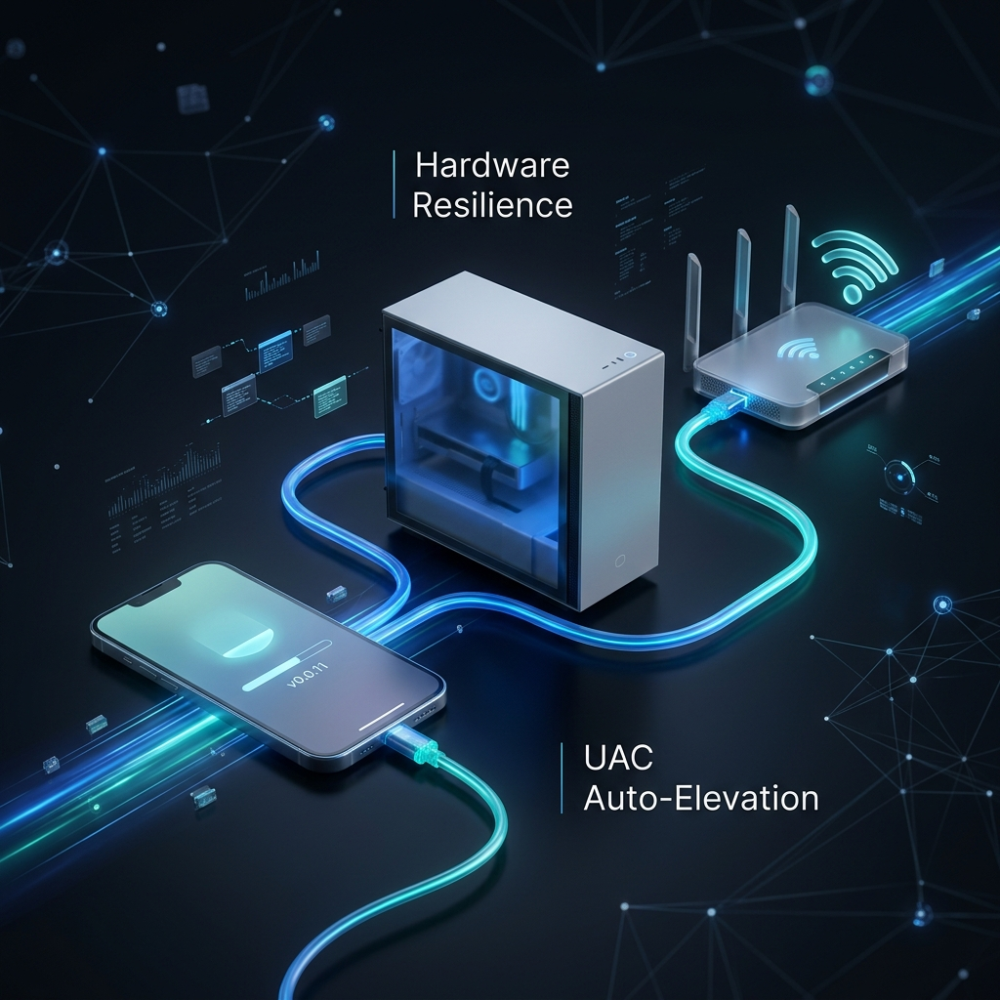

# 📱 Phone-to-PC-to-Router Automated Pipeline (AutoICS)

  

A set of specialized scripts designed to turn any Windows PC (even older hardware) into an automated bridge that shares mobile internet (via USB Tethering) to an external Router.

## 📄 Documentation
*   **[Code Documentation](CODE_DOCUMENTATION.md)**: Deep dive into the architecture and logic.
*   **[Design Philosophy](DESIGN_PHILOSOPHY.md)**: Why and how this project was built.
*   **[Contributing](CONTRIBUTING.md)**: How you can help improve the system.
*   **[Security Policy](SECURITY.md)**: Security standards and audit reports.

## 🚀 The Goal
To create a "Plug and Play" experience where you simply connect your phone via USB, and the PC automatically configures **Internet Connection Sharing (ICS)** to push that data through the Ethernet port into your router—restoring internet to your entire home Wi-Fi network without manual setup.

---

## 🛠 Project Components

| File | Description |
| :--- | :--- |
| **`Setup-Pipeline.bat`** | **Start Here.** One-click setup with **Auto-Elevation**. Installs the background service. |
| **`AutoICS.ps1`** | **Logic Engine.** Monitors adapters, auto-detects tether interfaces by hardware, and manages ICS. |
| **`Install-Service.ps1`** | Downloads **NSSM** and registers AutoICS as a Windows Service. |
| **`Rename-Adapters.ps1`** | Setup utility that auto-detects and renames your network adapters to `USB-Tether` and `LAN`. |
| **`Toggle-ICS.bat`** | **Manual Reset.** One-click utility with **Auto-Elevation** and **Windows Terminal** support to reset ICS. |
| **`Enable-Tether-ADB.bat`** | Optional utility to force-enable RNDIS (USB Tethering) via ADB. |
| **`Uninstall-Service.ps1`** | **Full Cleanup.** Removes service, deletes binaries/logs, and disables all sharing settings. |

---

## ⚙️ Initial Setup

### 1. Prerequisites
*   **Phone**: Poco F3 GT (or any Android device with USB Tethering).
*   **PC**: Windows 10/11 (x64 and x86 are supported; optimized for older systems).
*   **Router**: Configured in **Access Point (AP) Mode** (or DHCP disabled).

### 2. Installation
1.  Connect your phone to the PC via USB and enable **USB Tethering**.
2.  Double-click **`Setup-Pipeline.bat`**.
3.  The script will automatically:
    *   **Auto-Elevate**: Proactively request Admin rights and relaunch in Windows Terminal (if preferred).
    *   Interactively select and rename your source/target adapters (with smart auto-detection).
    *   Install the **AutoICS** background service.

---

## 🚦 How it Works (Autonomous Mode)

Once installed, you don't need to touch your PC. The system is **Self-Healing**:
1.  **Auto-Detection**: The service identifies your phone by its **hardware description** (Remote NDIS/RNDIS), meaning it works even if Windows renames the connection (e.g., from `Ethernet 5` to `Ethernet 6`) after a reboot.
2.  **Renaming**: It automatically renames the detected adapter to `USB-Tether` on every 30s cycle to maintain parity.
3.  **Activation**: If it detects the phone is "Up," it automatically enables ICS sharing to the `LAN` adapter.
4.  **Efficiency**: It uses only **~30MB of RAM** and **<1% CPU**, making it perfect for legacy hardware.
5.  **Logging**: It only writes to `auto-ics.log` when a status change or auto-rename occurs, preventing disk bloat.

---

## 🔒 Security & Integrity
*   **Admin Check**: All setup scripts verify administrative privileges before running.
*   **Binary Integrity**: `Install-Service.ps1` verifies the SHA1 hash of the `nssm.cc` download to prevent malicious tampering.
*   **Audit**: A full security audit was performed on 2026-04-04 (See **`SECURITY.md`**).

---

## 📦 Version Control (Git)
The project includes a specialized `.gitignore` to ensure your repository stays clean:
*   **Initial Commit**: `git add .` -> `git commit -m "Initial setup"`
*   **Excluded**: All `.log` files, `nssm.exe`, and temporary `.zip` files are automatically ignored.

---

## 🛑 Maintenance & Uninstallation
The uninstaller provides a **Full Cleanup** of the system state:
1.  Double-click **`Uninstall-Service.ps1`**.
2.  The script will:
    *   Stop and remove the Windows Service.
    *   **Disable ICS Sharing** (returning networking to default).
    *   Delete binaries (`nssm.exe`) and purge all log files.

---

## 📜 Logs 
Check these files in the root directory for real-time status:
*   `auto-ics.log`: Timeline of adapter detection and connection sharing.
*   `service.log`: Standard output log from the service manager.
*   `service-error.log`: Technical errors (if any occur).

---

## 💡 Advanced Tips & Best Practices

1.  **🚀 USB Hardware**: Your USB cable is the "backbone" of your home network. Use a high-quality, short USB 3.0 cable to ensure the highest data transfer speeds between your phone and the PC.
2.  **🔋 Phone Battery Settings**: On your Poco F3 GT, ensure that USB Tethering is not being optimized by the battery saver. Setting it as a "Developer Option" can help maintain stability during long sessions.
3.  **⚡ DNS Optimization**: To speed up website loading times, you can manually set your router's DNS to `8.8.8.8` (Google) or `1.1.1.1` (Cloudflare).
4.  **🌐 Mobile NAT (Port Forwarding)**: Most mobile data providers use CGNAT. If you need to host games or a web server, traditional port forwarding won't work. Consider using tools like **Tailscale** or **Cloudflare Tunnels** for external access.
5.  **🐢 Legacy Hardware**: This system uses ~30MB of RAM and <1% CPU, making it perfectly safe for even the oldest dual-core systems. No further optimization is needed for your 12-year-old PC.

---
